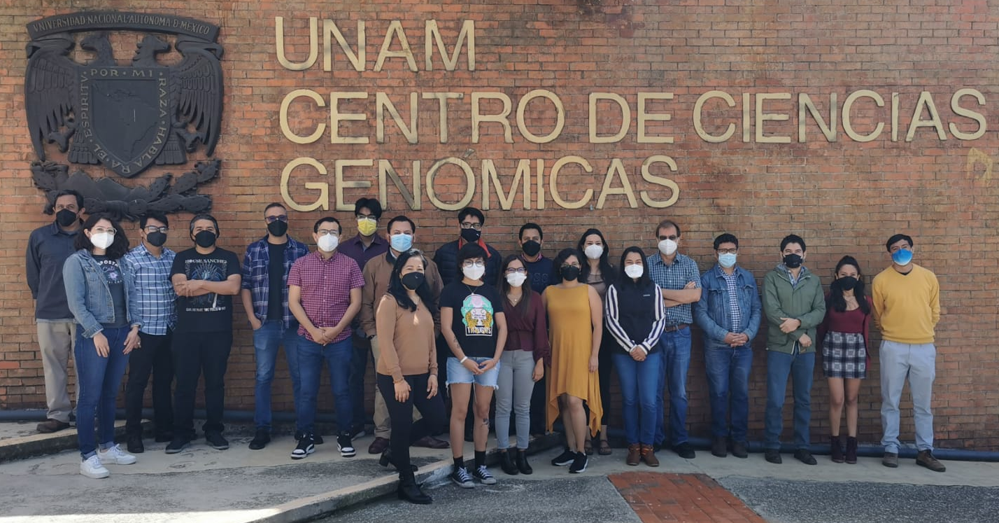
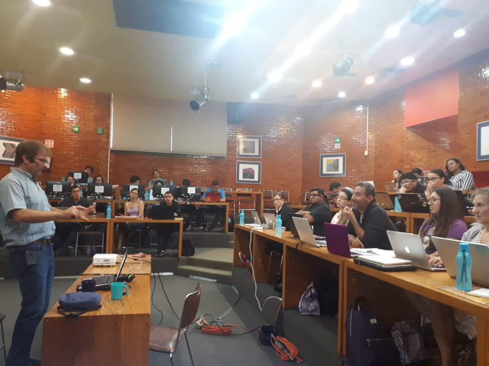

#  <b>TIB2024-FILO</b>

**TIB22 participants, 2022-08-03**

# <b>Talleres Internacionales de Bioinform&aacute;tica - Centro de Ciencias Gen&oacute;micas, UNAM, Cuernavaca, M&eacute;xico (TIB2024-FILO)</b>
Despu&eacute;s de una interrupci&oacute;n de dos años debida a la pandemia de SARS-CoV-2, volvemos a ofrecer regularmente el [Taller sobre Pangen&oacute;mica y Filoinform&aacute;tica microbiana](https://www.nnb.unam.mx/tib2024-1/pangenomica-y-filogenomica-microbiana/) (#TIB2024-FILO) de manera <b>presencial</b>. Este taller ha sido muy solicitado y altamente valorado por l@s participantes de ediciones anteriores, la &uacute;ltima en 2022 (TIB2022). 

 
## Presentaci&oacute;n
Este taller de nivel b&aacute;sico-intermedio te proporcionar&aacute; una s&oacute;lida base de conocimientos te&oacute;ricos y pr&aacute;cticos sobre aspectos fundamentales de bioc&oacute;mputo para inferencia filogen&eacute;tica, evoluci&oacute;n molecular y gen&oacute;mica microbiana, con &eacute;nfasis en an&aacute;lisis pangen&oacute;micos y filogen&oacute;micos.

### Descripci&oacute;n
En el taller (~36 hrs) tendremos sesiones te&oacute;ricas y pr&aacute;cticas que cubrir&aacute;n un amplio espectro del t&oacute;pico como:

- introducci&oacute;n al bioc&oacute;mputo en sistemas Linux para procesamiento eficiente de secuencias y datos moleculares
- formateo y escrutinio de bases de datos locales de secuencias mediante BLAST
- determinaci&oacute;n e interpretaci&oacute;n de homolog&iacute;a
- alineamiento de m&uacute;ltiples secuencias y conversi&oacute;n de formatos 
- inferencia filogen&eacute;tica estad&iacute;stica bajo criterios de optimizaci&oacute;n de m&aacute;xima verosimilitud
- an&aacute;lisis pangen&oacute;mico y filogen&oacute;mico de genomas microbianos

Se dar&aacute;n presentaciones detalladas del uso de programas clave (todos de “open source”) para estos an&aacute;lisis, usando datos tomados de las bases de datos. Tambi&eacute;n se presentar&aacute; el uso de algunos scripts de Bash y Perl muy sencillos, con el objetivo de aprender los aspectos b&aacute;sicos de estos lenguajes para el an&aacute;lisis de datos gen&oacute;micos.

Al final del curso tendr&aacute;n una amplia visi&oacute;n sobre el espectro de posibilidades que brindan la filogen&eacute;tica y la evoluci&oacute;n molecular en distintos tipos de estudios biol&oacute;gicos y gen&oacute;micos, que les servir&aacute;n como herramientas conceptuales y metodol&oacute;gicas de gran utilidad en su carrera como estudiantes o profesionales.

### Requisitos
#### Conocimientos previos
Es recomendable tener conocimientos b&aacute;sicos de Unix/Linux, ya que todas las demostraciones de software se har&aacute;n en este sistema operativo.

#### Requisitos t&eacute;cnicos
Es necesario que traigas tu computadora personal, de preferencia con Linux (o MacOS X) como sistema operativo. 

<b>Si usas Windows, deber&aacute;s tener instalado [MobaXterm](https://mobaxterm.mobatek.net/download-home-edition.html) (para Ms Windows) antes de llegar al taller!</b>. 

Aqu&iacute; tienes [instrucciones para la instalaci&oacute;n de MobaXterm en Windows](https://github.com/vinuesa/TIB-filoinfo/tree/master/docs/Instalaci&oacute;n_de_mobaXterm_en_Windows.pdf)

<!-- - Otra opci&oacute;n, para quienes tengan <b>Windows 10 o superior corriendo en una m&aacute;quina de 64 bits</b>, es [instalar Bash para Windows, habilitando "Windows Subsystem for Linux", como se explica aqu&iacute;](https://www.howtogeek.com/249966/how-to-install-and-use-the-linux-bash-shell-on-windows-10/). -->

### Sobre el profesor
Hola, me llamo [Pablo Vinuesa](http://www.ccg.unam.mx/~vinuesa/). Soy investigador titular del 
[Centro de Ciencias Gen&oacute;micas](http://www.ccg.unam.mx) de la 
[Universidad Nacional Aut&oacute;noma de M&eacute;xico - UNAM](http://www.unam.mx/).

Mis [l&iacute;neas de investigaci&oacute;n](http://www.ccg.unam.mx/~vinuesa/research.html) 
integran la gen&oacute;mica y la bioinform&aacute;tica con la biolog&iacute;a y gen&eacute;tica molecular para entender 
la evoluci&oacute;n y emergencia de pat&oacute;genos oportunistas a partir de microbios ambientales.

### Sobre los ayudantes
Tenemos el privilegio de contar con la ayuda de <b>Daniela Hernández</b> y <b>Mauricio Osorio</b> como ayudantes del [Taller](https://www.nnb.unam.mx/tib2024-1/pangenomica-y-filogenomica-microbiana/). Ambos son personas con un excelente trato, adem&aacute;s de ser alumn@s de posgardo de la UNAM con amplia experiencia en bionform&aacute;tica y filogen&eacute;tica.

### Sobre medidas de seguridad sanitaria para minimizar riesgo de infecci&oacute;n por SARS-CoV-2
Seguiremos estrictas medidas de seguridad para minimizar el riesgo latente de contraer COVID-19
- tendremos un aforo muy reducido, a < 25% de capaciad del auditorio, el cual cuenta con excelente ventilaci&oacute;n. 
- el uso correcto de cubrebocas KN95 o superior ser&aacute; obligatorio. 
- contaremos con varias [unidades de filtraci&oacute;n de aire Corsi-Rosenthal](https://aghealth.ucdavis.edu/es/news/la-caja-corsi-rosenthal-filtro-de-aire-casero-con-ventilador-de-caja-para-covid-19-y-el-humo)
<!-- - vamos a pedir prueba r&aacute;pida de ant&iacute;geno hecha < 48 hrs del inicio del taller --> 

*** 

## Sobre el material did&aacute;ctico
A trav&eacute;s de estas p&aacute;ginas se distribuyen los apuntes, ejercicios y datos que se usar&aacute;n en el [Taller sobre Pangen&oacute;mica y Filogen&oacute;mica Microbiana](https://www.nnb.unam.mx/tib2024-1/pangenomica-y-filogenomica-microbiana/).
Para tu convenienca, se distribuye en formatos pdf y html.

Puedes ver en mi sitio Web el [listados de cursos](http://www.ccg.unam.mx/~vinuesa/cursos.html) y materiales asociados, que pongo libremente disponible para la comunidad.

### Sobre el repositorio
Este repositorio contiene el material para el [Taller sobre Pangen&oacute;mica y Filoinform&aacute;tica microbiana](https://www.nnb.unam.mx/tib2024-1/pangenomica-y-filogenomica-microbiana/) de los [Talleres Internacionales de Bioinform&aacute;tica - TIB2024](https://www.nnb.unam.mx/talleres/), a celebrarse en el [Centro de Ciencias Gen&oacute;micas](http://www.ccg.unam.mx) de la [Universidad Nacional Aut&oacute;noma de M&eacute;xico](http://www.ccg.unam.mx), del 22 al 26 de enero de 2024.

### Clonaci&oacute;n del repositorio
- Si tienes instalado [git](https://git-scm.com/) en tu computadora, puedes clonar el repositorio con el comando:

   <code>git clone https://github.com/vinuesa/TIB-filoinfo.git</code>

- Para actualizar el repositorio, ejecuta este comando desde dentro del directorio TIBS-filoinfo
  
   <code>git pull https://github.com/vinuesa/TIB-filoinfo.git</code>

En [ubuntu](https://www.ubuntu.com/) y [MobaXterm](https://mobaxterm.mobatek.net/download-home-edition.html) es muy f&aacute;cil instalar git: 

  <code>sudo apt install git</code>

Vean adem&aacute;s las [instrucciones para la instalaci&oacute;n de MobaXterm en Windows](https://github.com/vinuesa/TIB-filoinfo/tree/master/docs/Instalaci&oacute;n_de_mobaXterm_en_Windows.pdf), 
que indican c&oacute;mo instalar el <i>Git plugin</i> de MobaXterm. 

#### Otros repositorios asociados a ediciones anteriores de los TIB
- [T2: An&aacute;lisis exploratorio y estad&iacute;stico de datos biol&oacute;gicos usando R](https://github.com/vinuesa/curso_Rstats), edici&oacute;n [TIB2018](http://congresos.nnb.unam.mx/TIB2018/)

### Licencia y t&eacute;rminos de uso
El material del [Taller, TIB-filoinfo](https://www.nnb.unam.mx/tib2024-1/pangenomica-y-filogenomica-microbiana/) lo distribuyo p&uacute;blicamente a trav&eacute;s de este repositorio GitHub bajo la [**Licencia No Comercial Creative Commons 4.0**](https://creativecommons.org/licenses/by-nc/4.0/) 

 This work is licensed under a <a rel="license" href="http://creativecommons.org/licenses/by-nc/4.0/">Creative Commons Attribution-NonCommercial 4.0</a>

***

## Agradecimientos
Quiero agradecer al [Nodo Nacional de Bioinform&aacute;tica - UNAM](https://www.nnb.unam.mx/) por el apoyo y facilidades prestadas para poder impartir este taller. Quiero expl&iacute;citamente agradecer, de manera muy especial, a la Dra. Irma Mart&iacute;nez Flores, la M.T.I. Shirley Alquicira Hern&aacute;ndez, al M.A.D. Alfredo Hern&aacute;ndez Alvarez e Iván Uhthoff Aguilera por su extraordinaria labor y capacidad.

***

## <b>Sesiones y material asociado</b>
### Horario y lugar de impartici&oacute;n de las sesiones
Las clases se imparten del 22 al 26 de enero en el auditorio Guillermo Sober&oacute;n del [CCG-UNAM](http://www.ccg.unam.mx/), Cuernavaca, Morelos
de 9 a 17:00 hrs, seg&uacute;n el [programa del TIB2024](https://www.nnb.unam.mx/tib2024-1/pangenomica-y-filogenomica-microbiana/)

**Sesión del Taller TIB2019 en el Auditorio Guillermo Soberón del CCG-UNAM**

### Lunes 22 de enero

#### <b>Sesi&oacute;n 1: Introducci&oacute;n a Linux (teor&iacute;a y pr&aacute;ctica)</b>
- [presentaci&oacute;n - PDF: Primer contacto con un sistema GNU/Linux](https://github.com/vinuesa/TIB-filoinfo/tree/master/docs/sesion1_intro2linux/Intro_biocomputo_Linux_pt1.pdf)
- Pr&aacute;ctica. Navegaci&oacute;n del sistema, uso de comandos b&aacute;sicos y ejercicio de parseo de archivo FASTA
  - [pr&aacute;ctica - html](https://vinuesa.github.io/TIB-filoinfo/sesion1_intro2linux/) 
  - [pr&aacute;ctica - pdf](https://github.com/vinuesa/TIB-filoinfo/tree/master/docs/sesion1_intro2linux/working_with_linux_commands.pdf)
  
<!--
+ Pr&aacute;ctica 2. Descarga de secuencias en formato FASTA de GenBank usando el sistema ENTREZ y parseo de los archivos usando herrramientas de filtrado
    - [pr&aacute;ctica2 - html](https://vinuesa.github.io/OMICAS_UAEM/practica2_parseo_fastas/)
    - [pr&aacute;ctica2 - pdf](https://github.com/vinuesa/OMICAS_UAEM/tree/master/docs/practica2_parseo_fastas/ejercicio_parseo_fastas_ENTREZ.pdf)
-->

- Lecturas recomendadas:
  - Atma Ivancevic. The ten commandments for learning how to code. [Carrer Column, Nature, 20 Feb. 2019](https://www.nature.com/articles/d41586-019-00653-5)
  - Velez Rueda AJ, Ben&iacute;tez GI, Marchetti J, Hasenahuer MA, Fornasari MS, Palopoli N, Parisi G. Bioinformatics calls the school: Use of smartphones to introduce
Python for bioinformatics in high schools. [PLoS Comput Biol. 2019 Feb 14;15(2):e1006473.](https://journals.plos.org/ploscompbiol/article?id=10.1371/journal.pcbi.1006473)
  - Dudley JT, Butte AJ. A quick guide for developing effective bioinformatics programming skills. [PLoS Comput Biol. 2009 Dec;5(12):e1000589](https://journals.plos.org/ploscompbiol/article?id=10.1371/journal.pcbi.1000589)
  - The Linux Command Line - a complete introduction. [William E. Shotts, Jr. No Starch Press](http://linuxcommand.org/lc3_learning_the_shell.php#contents)
  - Bioinformatics Data Skills: Reproducible and Robust Research with Open Source Tools. [Vince Buffalo. O'Reilly Media 2014](http://freecomputerbooks.com/Bioinformatics-Data-Skills.html)

#### <b>Sesi&oacute;n 2: Conceptos b&aacute;sicos de biolog&iacute;a evolutiva, filogen&eacute;tica y (pan)gen&oacute;mica microbiana</b>
- [presentaci&oacute;n - PDF: conceptos b&aacute;sicos de filogen&eacute;tica y evoluci&oacute;n](https://github.com/vinuesa/TIB-filoinfo/tree/master/docs/sesion2_conceptos_basicos/sesion2_conceptos_basicos_filogenetica_y_evol.pdf)

- Lecturas recomendadas
  - Fitch WM. Homology a personal view on some of the problems. [Trends Genet. 2000 May;16(5):227-31](https://www.ncbi.nlm.nih.gov/pubmed/10782117)
  - Koonin EV. Orthologs, paralogs, and evolutionary genomics. [Annu Rev Genet. 2005;39:309-38](https://www.ncbi.nlm.nih.gov/pubmed/16285863)
  - Glover N, Dessimoz C, Ebersberger I, Forslund SK, Gabald&oacute;n T, Huerta-Cepas J, Martin MJ et al. Quest for Orthologs Consortium. Advances and Applications in the Quest for Orthologs. [Mol Biol Evol. 2019 Jun 26. pii: msz150. doi: 10.1093/molbev/msz150.](https://www.ncbi.nlm.nih.gov/pubmed/31241141)
  - Vernikos G, Medini D, Riley DR, Tettelin H. Ten years of pan-genome analyses. [Curr Opin Microbiol. 2015 Feb;23:148-54](https://www.ncbi.nlm.nih.gov/pubmed/25483351)
  - McInerney JO, McNally A, O'Connell MJ. Why prokaryotes have pangenomes. [Nat Microbiol. 2017 Mar 28;2:17040](https://www.ncbi.nlm.nih.gov/pubmed/28350002)
  - Sela I, Wolf YI, Koonin EV. Theory of prokaryotic genome evolution. [Proc Natl Acad Sci U S A. 2016 Oct 11;113(41):11399-11407](https://www.ncbi.nlm.nih.gov/pubmed/27702904)
  - Land M, Hauser L, Jun SR, Nookaew I, Leuze MR, Ahn TH, Karpinets T, Lund O, Kora G, Wassenaar T, Poudel S, Ussery DW. Insights from 20 years of bacterial genome sequencing. [Funct Integr Genomics. 2015 Mar;15(2):141-61](https://www.ncbi.nlm.nih.gov/pubmed/25722247)

***

### Martes 23 de enero

#### <b>Sesi&oacute;n 3: B&uacute;squeda de hom&oacute;logos usando BLAST desde la l&iacute;nea de comandos (teor&iacute;a y pr&aacute;cticas)</b>
- [presentaci&oacute;n - PDF](https://github.com/vinuesa/TIB-filoinfo/tree/master/docs/sesion3_BLAST/Tema3_BLAST_OVERVIEW.pdf)
- pr&aacute;ctica
  - [comandos, html](https://vinuesa.github.io/TIB-filoinfo/sesion3_BLAST)
  - [16S_4blastN.tgz](https://github.com/vinuesa/TIB-filoinfo/tree/master/docs/sesion3_BLAST/data/16S_4blastN.tgz)
  - [gene_discovery_and_annotation_using_blastx.tgz](https://github.com/vinuesa/TIB-filoinfo/tree/master/docs/sesion3_BLAST/data/gene_discovery_and_annotation_using_blastx.tgz)
  - [split_fasta.pl](https://github.com/vinuesa/TIB-filoinfo/tree/master/docs/bin/split_fasta.pl)
  - [blast-imager.pl](https://github.com/vinuesa/TIB-filoinfo/tree/master/docs/bin/blast-imager.pl)
- Lecturas recomendadas
  - Camacho C, Coulouris G, Avagyan V, Ma N, Papadopoulos J, Bealer K, Madden TL. [BLAST+: architecture and applications. BMC Bioinformatics. 2009 Dec 15;10:421](https://www.ncbi.nlm.nih.gov/pubmed/20003500)
  - Hu G, Kurgan L. Sequence Similarity Searching. [Curr Protoc Protein Sci. 2019 Feb;95(1):e71. doi: 10.1002/cpps.71](https://www.ncbi.nlm.nih.gov/pubmed/30102464)

#### <b>Sesi&oacute;n 4: Alineamientos m&uacute;ltiples (teor&iacute;a y pr&aacute;cticas)</b>
- [presentaci&oacute;n - PDF](https://github.com/vinuesa/TIB-filoinfo/tree/master/docs/sesion4_alineamientos/Tema4_alineamientos_multiples.pdf)
- pr&aacute;ctica
  - [comandos, txt](https://github.com/vinuesa/TIB-filoinfo/tree/master/docs/sesion4_alineamientos/practicas_aln_multiples_clustal.cmds)
  - [sequences, tgz](https://github.com/vinuesa/TIB-filoinfo/tree/master/docs/sesion4_alineamientos/sequences_for_alingment.tgz)
  - [align_seqs_with_clustal_or_muscle.sh](https://github.com/vinuesa/TIB-filoinfo/tree/master/docs/bin/align_seqs_with_clustal_or_muscle.sh)
  - [convert_alnFormats_using_clustalw.sh](https://github.com/vinuesa/TIB-filoinfo/tree/master/docs/bin/convert_alnFormats_using_clustalw.sh)
  - [convert_aln_format_batch_bp.pl](https://github.com/vinuesa/TIB-filoinfo/tree/master/docs/bin/convert_aln_format_batch_bp.pl)
  - [translate_fastas.pl](https://github.com/vinuesa/TIB-filoinfo/tree/master/docs/bin/translate_fastas.pl)
  - [prot2cdnAlns.pl](https://github.com/vinuesa/TIB-filoinfo/tree/master/docs/bin/prot2cdnAlns.pl)
- Lecturas recomendadas
  - Simossis V, Kleinjung J, Heringa J. An overview of multiple sequence alignment. [Curr Protoc Bioinformatics. 2003 Nov;Chapter 3:Unit 3.7](https://www.ncbi.nlm.nih.gov/pubmed/18428699)
  - Sievers F, Wilm A, Dineen D, Gibson TJ, Karplus K, Li W, Lopez R, McWilliam H, Remmert M, Söding J, Thompson JD, Higgins DG. Fast, scalable generation of high-quality protein multiple sequence alignments using Clustal Omega. [Mol Syst Biol. 2011 Oct 11;7:539](https://www.ncbi.nlm.nih.gov/pubmed/21988835)
  - Sievers F, Higgins DG. Clustal Omega for making accurate alignments of many protein sequences. [Protein Sci. 2018 Jan;27(1):135-145](https://www.ncbi.nlm.nih.gov/pubmed/28884485)

***

### Mi&eacute;rcoles 24 de enero

#### <b>Sesi&oacute;n 5: Introducci&oacute;n a los m&eacute;todos filogen&eacute;ticos, modelos de sustituci&oacute;n y algoritmos de b&uacute;squeda de &aacute;rboles</b>
- [presentaci&oacute;n - PDF](https://github.com/vinuesa/TIB-filoinfo/tree/master/docs/sesion5_metodos_filogeneticos_y_modelos/Tema5_metodos_filogeneticos_y_modelos.pdf)
- Lecturas recomendadas
  - Yang Z, Rannala B. Molecular phylogenetics: principles and practice. [Nat Rev Genet. 2012 Mar 28;13(5):303-14](https://www.ncbi.nlm.nih.gov/pubmed/22456349)

#### <b>Sesi&oacute;n 6: Selecci&oacute;n de modelos e inferencia de filogenias bajo m&aacute;xima verosimilitud (teor&iacute;a y pr&aacute;ctica)</b>
- [presentaci&oacute;n - PDF](https://github.com/vinuesa/TIB-filoinfo/tree/master/docs/sesion6_maxima_verosimilitud/Tema6_maxima_verosimilitud_y_seleccion_de_models.pdf)
- pr&aacute;ctica
  - [tutorial phyml, comandos - html](https://vinuesa.github.io/TIB-filoinfo/sesion6_maxima_verosimilitud/)
  - [tutorial phyml (secuencias), tgz](https://github.com/vinuesa/TIB-filoinfo/tree/master/docs/sesion6_maxima_verosimilitud/phyml_tutorial_data.tgz)
  - [tutorial jmodeltest (presentaci&oacute;n) - pdf](https://github.com/vinuesa/TIB-filoinfo/tree/master/docs/sesion6_maxima_verosimilitud/jmodeltest_tutorial.pdf)
  - [tutorial jmodeltest (comandos y secuencias), tgz](https://github.com/vinuesa/TIB-filoinfo/tree/master/docs/sesion6_maxima_verosimilitud/jmodeltest_tutorial.tgz)
- Lecturas recomendadas
  - Lefort V, Longueville JE, Gascuel O. SMS: Smart Model Selection in PhyML. [Mol Biol Evol. 2017 Sep 1;34(9):2422-2424](https://www.ncbi.nlm.nih.gov/pubmed/28472384)
  - Criscuolo A. morePhyML: improving the phylogenetic tree space exploration with PhyML 3. Mol [Phylogenet Evol. 2011 Dec;61(3):944-8](https://www.ncbi.nlm.nih.gov/pubmed/21925283)
  - Guindon S, Dufayard JF, Lefort V, Anisimova M, Hordijk W, Gascuel O. New algorithms and methods to estimate maximum-likelihood phylogenies: assessing the performance of PhyML 3.0. [Syst Biol. 2010 May;59(3):307-21](https://www.ncbi.nlm.nih.gov/pubmed/20525638)

<!--
#### <b>Inferencia bayesiana de filogenias (teor&iacute;a y pr&aacute;ctica)</b>
- Lecturas recomendadas
  - Nascimento FF, Reis MD, Yang Z. A biologist's guide to Bayesian phylogenetic analysis. [Nat Ecol Evol. 2017 Oct;1(10):1446-1454](https://www.ncbi.nlm.nih.gov/pubmed/28983516)

-->

***

### Jueves 25 de enero
#### <b>C&oacute;mputo de familias de genes hom&oacute;logos con datos gen&oacute;micos usando GET_HOMOLOGUES(teor&iacute;a)</b>
- [presentaci&oacute;n - PDF](https://github.com/vinuesa/TIB-filoinfo/tree/master/docs/sesion7_pangenomica_GET_HOMOLOGUES/pangenomica_microbiana_y_GET_HOMOLOGUES.pdf)
- [pr&aacute;ctica GET_HOMOLOUGES+GET_PHYLOMARKERS- html](https://vinuesa.github.io/TIB-filoinfo/sesion7_pangenomica_GET_HOMOLOGUES/) 
<!--- [An&aacute;lisis pangen&oacute;mico con GET_HOMOLOGUES (c&oacute;digo) - txt](https://github.com/vinuesa/TIB-filoinfo/tree/master/docs/sesion7_pangenomica_GET_HOMOLOGUES/data/code4_GET_HOMOLOGUES_TIB19-T3.txt)-->
- [An&aacute;lisis pangen&oacute;mico con GET_HOMOLOGUES (secuencias) - tgz](https://github.com/vinuesa/TIB-filoinfo/tree/master/docs/sesion7_pangenomica_GET_HOMOLOGUES/data/pIncAC.tgz)

- Lecturas recomendadas
  - Medini D, Donati C, Tettelin H, Masignani V, Rappuoli R. The microbial pan-genome. [Curr Opin Genet Dev. 2005 Dec;15(6):589-94](https://www.ncbi.nlm.nih.gov/pubmed/16185861)
  - Contreras-Moreira B, Vinuesa P. GET_HOMOLOGUES, a versatile software package for scalable and robust microbial pangenome analysis. [Appl Environ Microbiol. 2013 Dec;79(24):7696-701](https://www.ncbi.nlm.nih.gov/pubmed/24096415)
  - Vinuesa P, Contreras-Moreira B. Robust identification of orthologues and paralogues for microbial pan-genomics using GET_HOMOLOGUES: a case study of pIncA/C plasmids. [Methods Mol Biol. 2015;1231:203-32](https://www.ncbi.nlm.nih.gov/pubmed/25343868)
  - Freschi L, Vincent AT, Jeukens J, Emond-Rheault JG, Kukavica-Ibrulj I, Dupont MJ, Charette SJ, Boyle B, Levesque RC. The Pseudomonas aeruginosa Pan-Genome Provides New Insights on Its Population Structure, Horizontal Gene Transfer, and Pathogenicity. [Genome Biol Evol. 2019 Jan 1;11(1):109-120](https://www.ncbi.nlm.nih.gov/pubmed/30496396)

***

### Viernes 26 de enero
#### <b>Estrategias para la estima de filogenias gen&oacute;micas</b>
- [presentaci&oacute;n - PDF](https://github.com/vinuesa/TIB-filoinfo/tree/master/docs/sesion8_filogenomica_GET_PHYLOMARKERS/get_phylomarkers_overview.pdf)
- [tutorial GET_PHYLOMARKERS - html](https://github.com/vinuesa/get_phylomarkers/blob/master/docs/GET_PHYLOMARKERS_manual.md#get_phylomarkers-tutorial)
- [pr&aacute;ctica GET_HOMOLOUGES+GET_PHYLOMARKERS- html](https://vinuesa.github.io/TIB-filoinfo/sesion7_pangenomica_GET_HOMOLOGUES/)
#### <b>Estima de filogenias gen&oacute;micas con GET_PHYLOMARKERS (pr&aacute;cticas)</b>
- Lecturas recomendadas
  - Vinuesa P, Ochoa-S&aacute;nchez LE, Contreras-Moreira B. GET_PHYLOMARKERS, a Software Package to Select Optimal Orthologous Clusters for Phylogenomics and Inferring Pan-Genome Phylogenies, Used for a Critical Geno-Taxonomic Revision of the Genus Stenotrophomonas. [Front Microbiol. 2018 May 1;9:771](https://www.frontiersin.org/articles/10.3389/fmicb.2018.00771/full)

#### <b>Pangen&oacute;mica y evoluci&oacute;n de pat&oacute;genos oportunistas multidrogo-resistentes (seminario integrativo de investigaci&oacute;n)</b>

***

## Lista de software
- [blast+](https://blast.ncbi.nlm.nih.gov/Blast.cgi?PAGE_TYPE=BlastDocs&DOC_TYPE=Download)
- [clustal omega](http://www.clustal.org/omega/)
- [seaview](http://doua.prabi.fr/software/seaview)
- [PhyML](https://github.com/stephaneguindon/phyml)
- [jModelTest2](https://github.com/ddarriba/jmodeltest2)
- [FigTree](https://github.com/rambaut/figtree/releases/tag/v1.4.4)
- [GET_HOMOLOGUES](https://github.com/eead-csic-compbio/get_homologues/releases)
- [GET_PHYLOMARKERS](https://github.com/vinuesa/get_phylomarkers)

## Lista de scripts

- [blast-imager.pl](https://github.com/vinuesa/TIB-filoinfo/tree/master/docs/bin/blast-imager.pl)
- [col_sumStats.sh](https://github.com/vinuesa/TIB-filoinfo/blob/master/col_freqAndHistogram.sh)
- [compute_RBH_clusters.sh](https://github.com/vinuesa/TIB-filoinfo/blob/master/compute_RBH_clusters.sh)
- [convert_aln_format_batch_bp.pl](https://github.com/vinuesa/TIB-filoinfo/blob/master/convert_aln_format_batch_bp.pl)
- [fasta_toolkit.awk](https://github.com/vinuesa/TIB-filoinfo/blob/master/fasta_toolkit.awk)
- [phyml_DNAmodelFinder.sh](https://github.com/vinuesa/TIB-filoinfo/blob/master/phyml_DNAmodelFinder.sh)
- [phyml_protModelFinder.sh](https://github.com/vinuesa/TIB-filoinfo/blob/master/phyml_protModelFinder.sh)
- [prot2cdnAln.pl](https://github.com/vinuesa/TIB-filoinfo/blob/master/prot2cdnAln.pl)
- [split_fasta.pl](https://github.com/vinuesa/TIB-filoinfo/tree/master/docs/bin/split_fasta.pl)
- [translate_fastas.pl](https://github.com/vinuesa/TIB-filoinfo/blob/master/translate_fastas.pl)

<!--- [MrBayes](http://nbisweden.github.io/MrBayes/)-->

